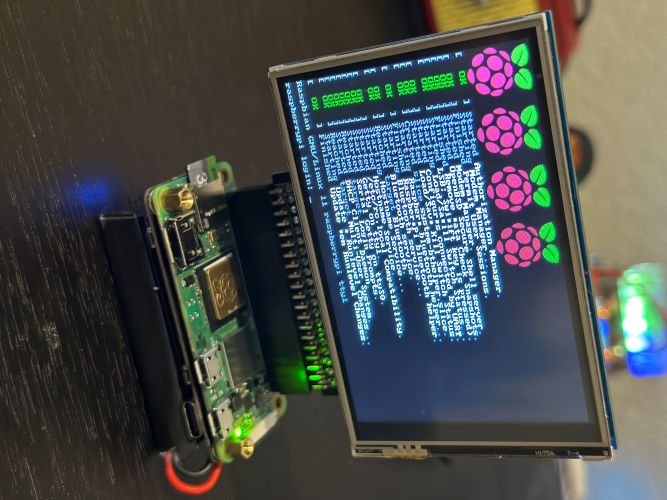
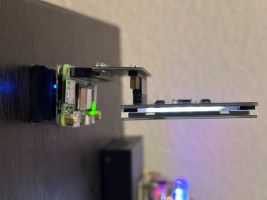
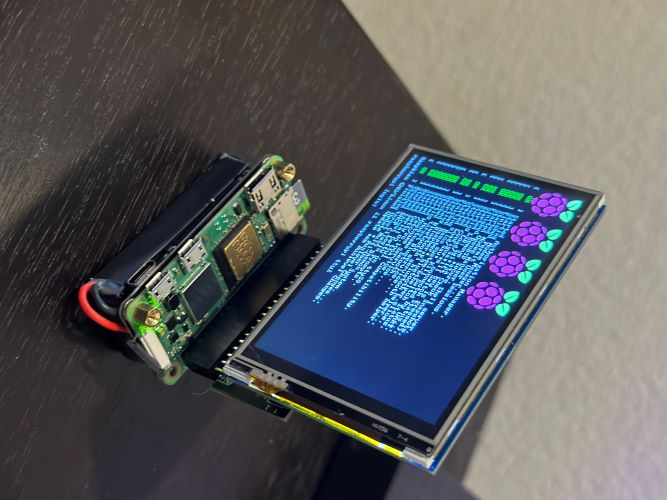

# tinySetup



# Materials
(x1) [Raspberry Pi Zero 2 WH](https://amzn.to/4bwP5q9)<br />
(x1) [Micro SD Cards](https://amzn.to/454betk)<br />
(x1) [Waveshare 3.5-in LCD display](https://amzn.to/4bLtsCz)<br />
(x1) [GPIO extender](https://amzn.to/4bGfj9M)<br />
(x1) [Battery pack](https://amzn.to/3Uooea9)<br />
<br />
_(Amazon affiliate links)_<br />
## **Installations**

1. **OS install:**
   - Raspberry Pi Zero 2 WH - Pi OS Lite 

2. Install 3.5-inch display Driver 
    ```
    git clone https://github.com/goodtft/LCD-show.git
    chmod -R 755 LCD-show
    cd LCD-show/
    ./LCD35-show
    ```

    Rotate screen 180 degrees
    ```
    cd LCD-show/
    ./LCD35-show 180
    ```
   Revert back to HDMI
    ```
    cd LCD-show/
    ./LCD-hdmi
    ```
    
    _[More info](https://github.com/lcdwiki/LCD-show-retropie)_
   
<br />
